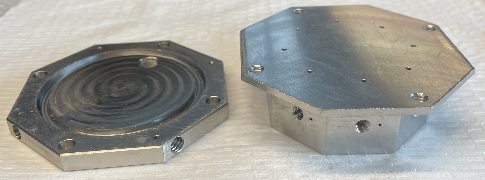
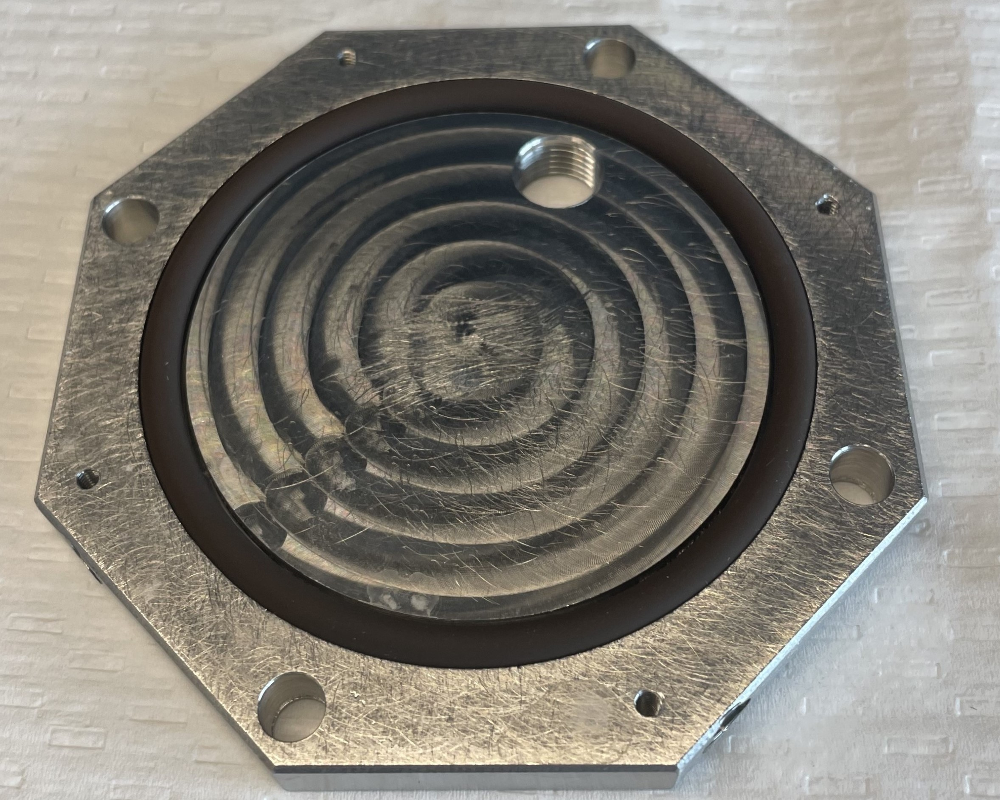
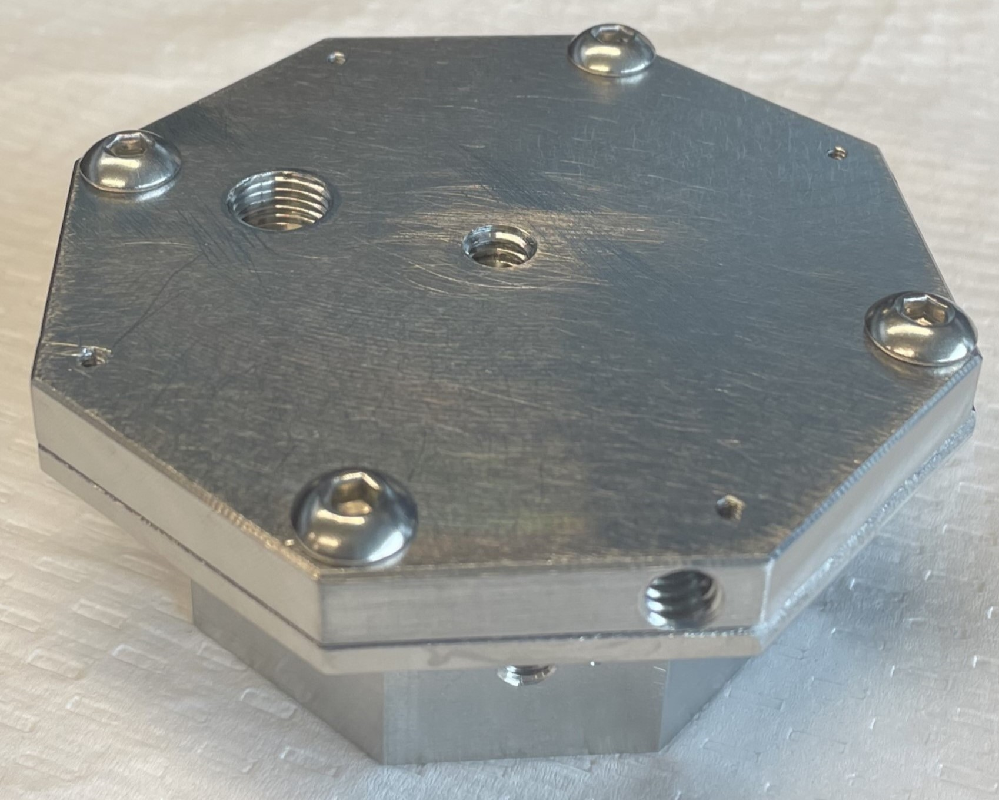
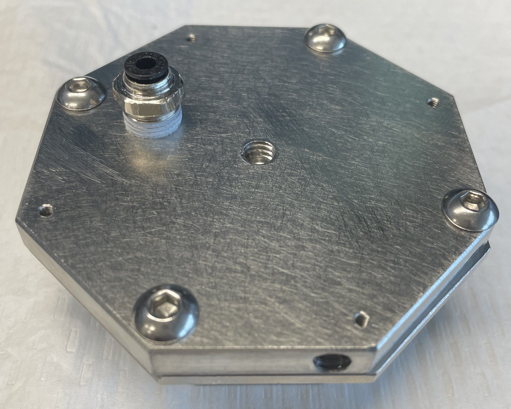
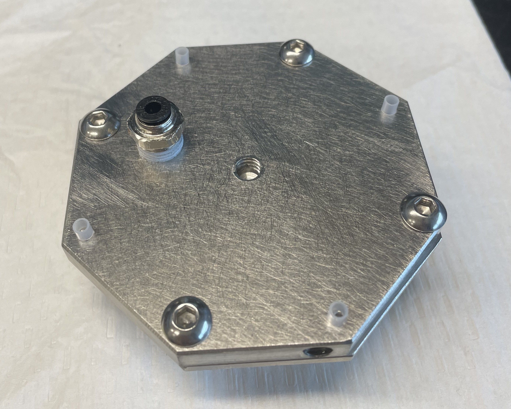
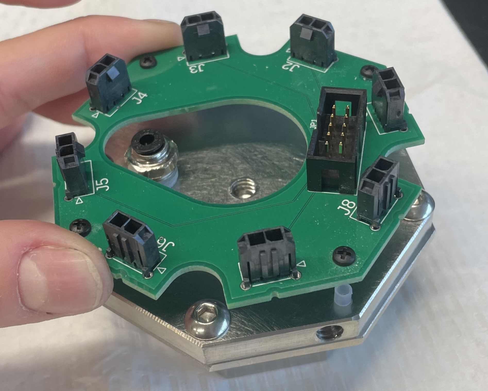
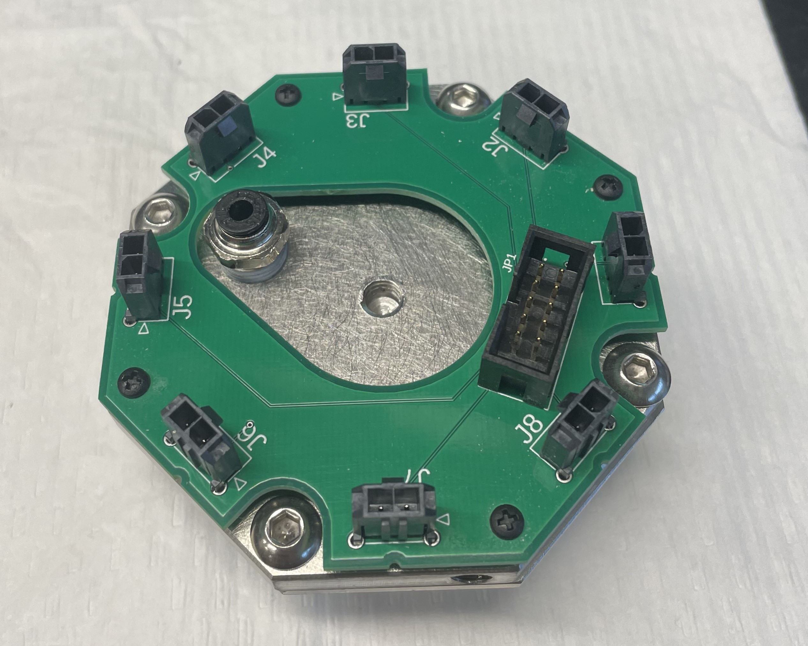

## Connect cover to heart

- (x1) Clippard 8-MC cover
- (x1) Clippard 8-MC heart
- (x4) 10-24 x 1/2" screw
- (x1) #227 O-ring
- (x1) 1/8 NPT Male to 1/4" Tube OD Push-To-Connect Fitting

 

Fit o-ring into cover.  

Place cover on top of heart. Secure with 10-24 screws. (May be easiest to hold assembly upside-down.) Tighten screws only a little bit at a time, and in random order. (This will ensure o-ring stays in correct position.)  

    
    

Screw input fitting into cover.  

 

## PCB to cover

- (x1) PCB
- (x4) Nylon Unthreaded Spacer
- (x4) 2-56 x 1/4" Nylon Pan Head Screw

Place spacers on cover, on top of the holes with the small screw threads.  

Insert screws through holes in PCB.  
Carefully place the PCB on top of the spacers, positioning it so that the screws pass through the spacers.  

Screw them into the cover to secure the PCB.  

 

## mount it

 
- However you plan on mounting it

  

## isolation valves
 - (x8) Clippard EV-2M-24-H-V isolation valves

  
 - Screw in until hand tight, then use something to get them an extra 1/4 turn or so. Connect to PCB.
  