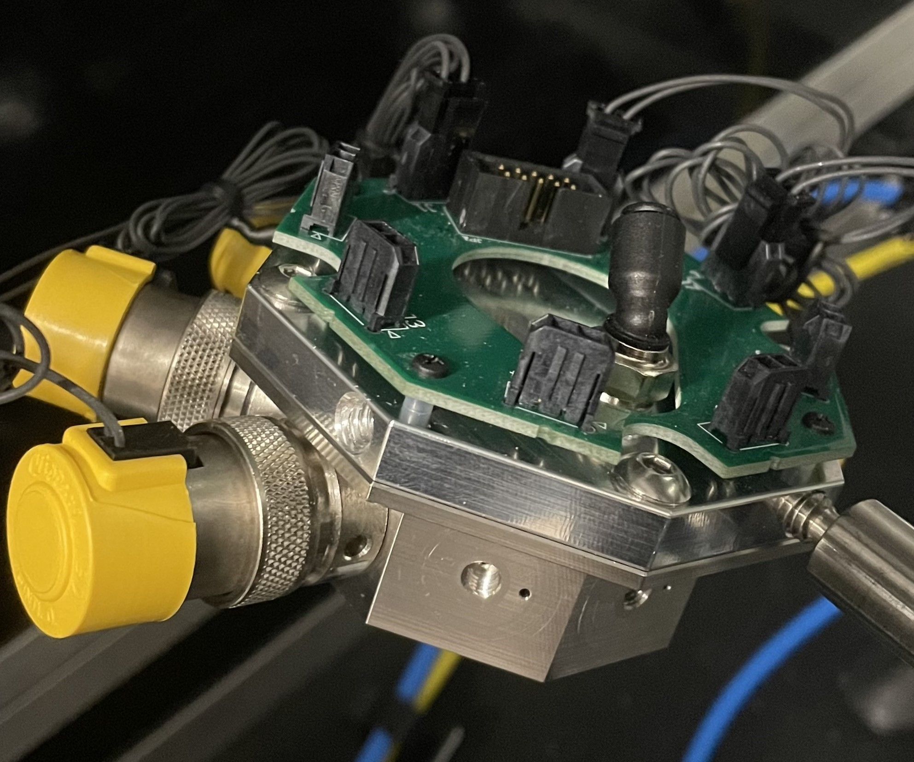

# Clippard Mixing Chamber

  

 

  
  

 

  
  

  

# Parts to be manufactured

to make a single unit:

- (x1) Clippard 8-MC cover
- (x1) Clippard 8-MC heart

  

## updates for version 2:
- **Clippard 8-MC cover**
    - Slightly different location of PCB mounting holes
- **Clippard 8-MC heart**
    - Removed bottom depression, outlet changed from a male thread to an NResearch (1/4-28) female hole (matches the vial inlet holes)
    - Odor (vial) inlet ID changed
    - Odor input hole (from the bottom) was previously not aligned with its connecting inlet hole (horizontal) - tied geometries together

