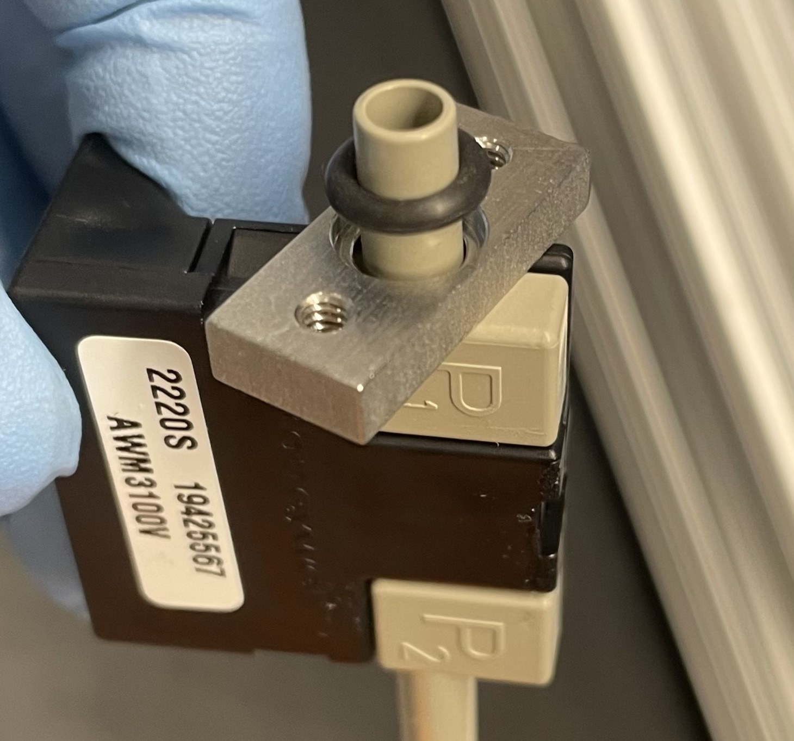
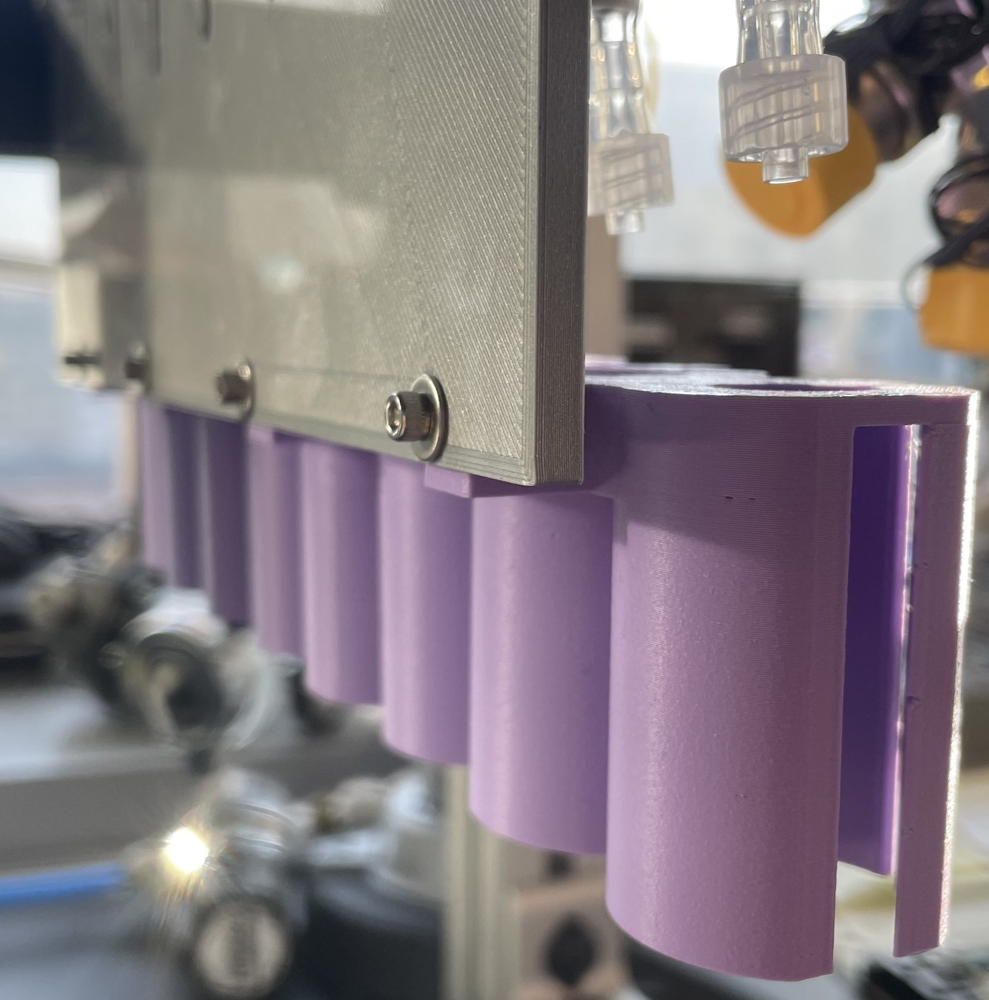

## Main manifold to top cover (with o-ring)

- (x1) main manifold
- (x1) top cover
- (x1) o-ring (-051)
- (x10) 4-40 x 1/4" screw
- (x10) 4-40 washer
- (x1) Straight Adapter, for 1/4" Tube OD x 1/8 NPT Male

 
Fit o-ring into main manifold groove.

 

Place top cover on top of main manifold. Secure with 4-40 screws & washers.  

 

Screw input fitting into main manifold.

 

 

## Proportional valves to main manifold

- (x8) proportional valves
- (x16) o-rings
- (x16) 4-40 x 5/8" screw

Place one o-ring onto each countersink of the proportional valve. Insert screws through holes on opposite side of valve. Hold valve flush to main manifold and tighten the screws to secure.  
 

## Main plate

- (x1) main plate
- (x3) 4-40 x 1/4" screw

Attach main plate to main manifold using 4-40 x 1/4" screws.  
 

## Flow sensors

### Output tubing
- (x8) flow sensors
- 1/4" OD 1/8" ID tubing
- (x8) male luer to 1/8" barb

Cut a ~1" piece of tubing. Slide the end onto the output (P2) of the flow sensor. Insert the luer barb into the other end of the tubing.  
 

### Input Connection
- (x8) o-rings
- (x8) main manifold cover
- (x16) 4-40 x 7/8" screw

Insert flow sensor input (P1) through the main manifold cover (with the o-ring groove facing away from the flow sensor). Slide o-ring onto the end of the flow sensor (same side as the o-ring groove).  
 

Drop (x2) 4-40 x 7/8" screws through the top of hte main manifold. Fit the flow sensor input into the main manifold (header pins should slide through the slot in the main plate).  

While securely holding the input (P1) of the flow sensor flush to the main manifold, secure the screws into the main manifold cover.  
 

### Secure to main plate

- (x8) 4-40 x 3/8" screws
- (x8) 4-40 hex nuts

Secure flow sensors to main plate using 4-40 x 3/8" screws and hex nuts. (possibly connect PCB before doing so, to make sure it's all aligned) (They don't need to be super tight, just secure enough to the main plate to make it easier to connect the PCB).  
 

## Mounting brackets

- (x2) mounting brackets
- (x4) 4-40 x 1/2" screw
- (x2) M8 screws

Attach mounting brackets to main manifold using 4-40 screws.  
Use M8 screws to mount main manifold (for convenience for rest of assembly).  
 

## Vial holders

- (x4) vial holders
- (x4) 4-40 heat set inserts
- (x4) 4-40 x 3/8" screws

Install heat set inserts into vial holders.  

Position vial holder flush against main plate and secure with screws.  

 

## PCB

Connect PCB to flow sensors. Be SUPER careful that all pins are aligned correctly. (If not, flow sensors will burn out).  