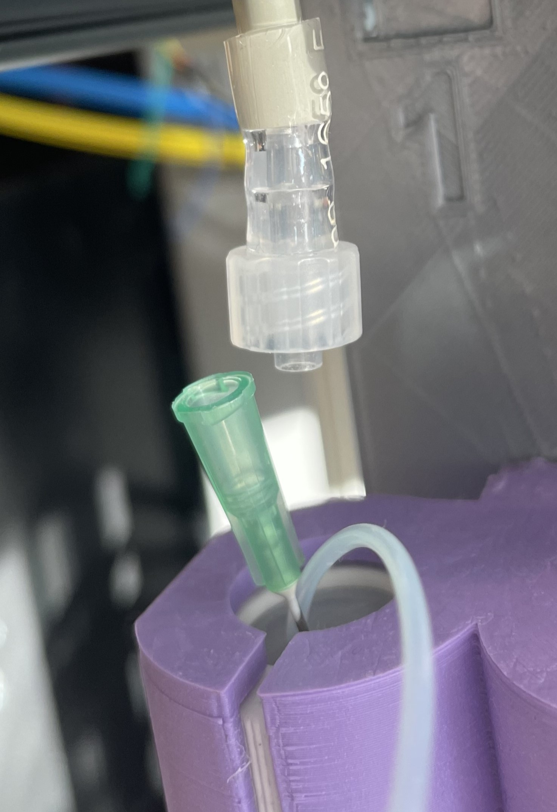
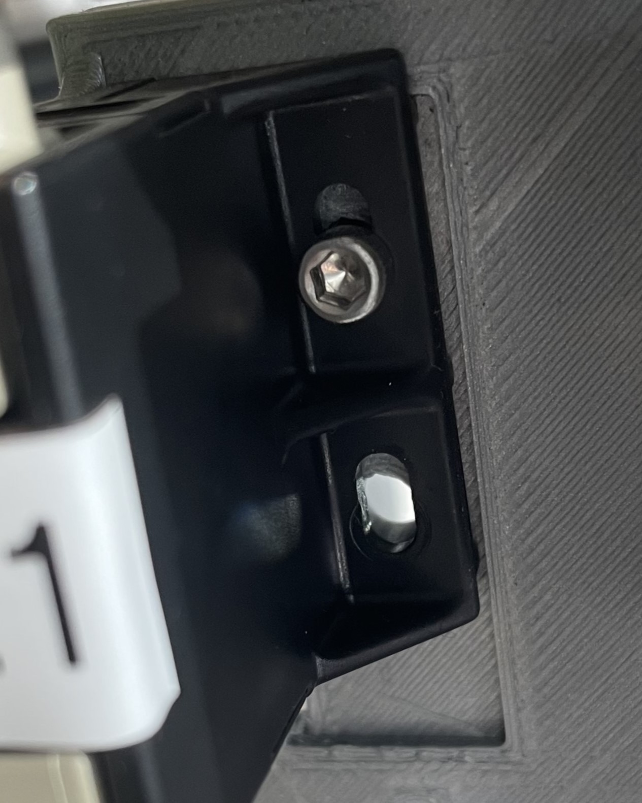
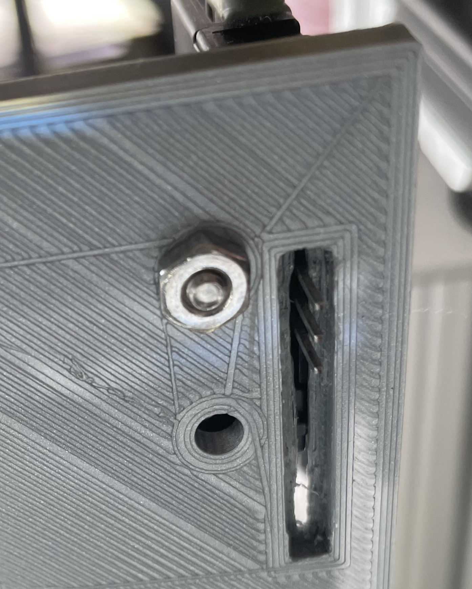
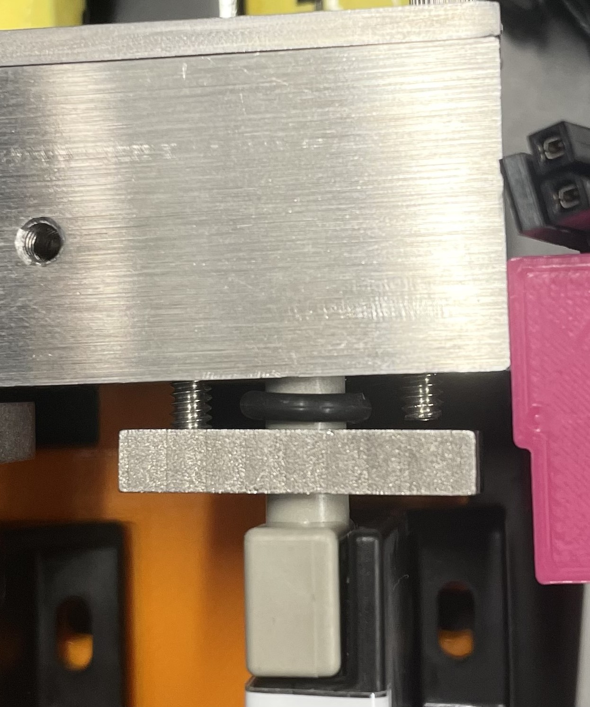

# Olfactometer disassembly (draft)

- Disconnect input air (Alicat MFC) from olfactometer manifold
- Disconnect 24V power supply & Arduino cable from olfactometer PCB
- Disconnect Mixing Chamber cable from olfactometer PCB
- Carefully remove olfactometer PCB from flow sensors

 

**To remove single flow sensor:**  

- Disconnect flow sensor output luer fitting from needle in odor vial.  

- Remove 4-40 screw and nut securing flow sensor to 3D printed main plate.  

    
    

- Loosen the (x2) 4-40 screws through the main manifold/main manifold cover, and pull the flow sensor down until it is disconnected

