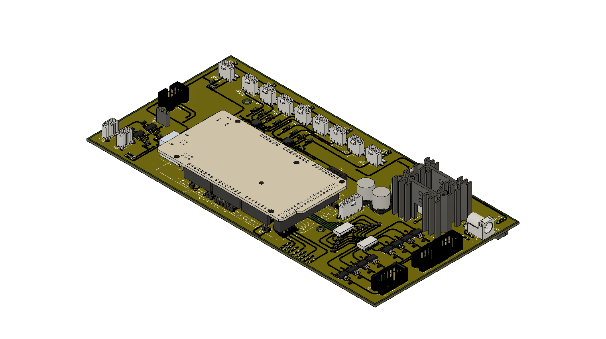

# 8-line Olfactometer

## updates for version 2:

### power:
- single 24V power supply (instead of 1x 24V supply and 1x 10V supply)
    - voltage regulators & corresponding circuitry to shift down to 10V for the components that need it
    - (2 voltage regulators + heat sinks to prevent overheating when multiple lines activated at once)

### error fixes:
- fixes (x4) incorrectly wired proportional valves
- removes connection between isolation valves 3 & 8

### other:
- multiple boards can be chained together by a single ribbon cable, which carries the power and I2C lines
    - (only 1 board in the chain needs a 24V input, the rest receive power through the ribbon cable)
- updated header for connecting to mixing chamber (standard 10pos IDC cable)

### new components:
- (x8) LEDs to indicate isolation valve activated
- (x2) LEDs to indicate power (10V, 24V)
- (x1) connection for additional flow sensor
- (x1) connection for additional proportional valve
- (x2) connection for additional isolation valve
- (x1) connection for Alicat MFC
