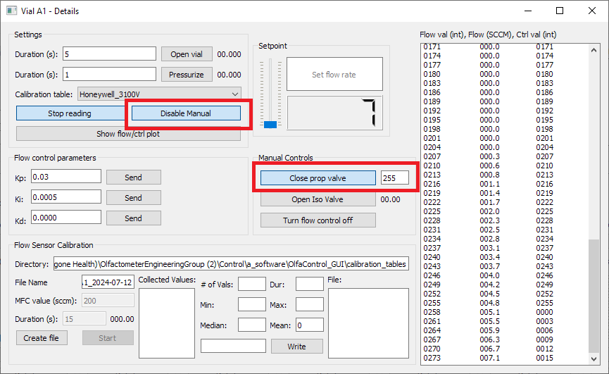
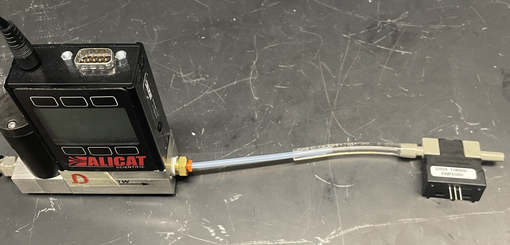
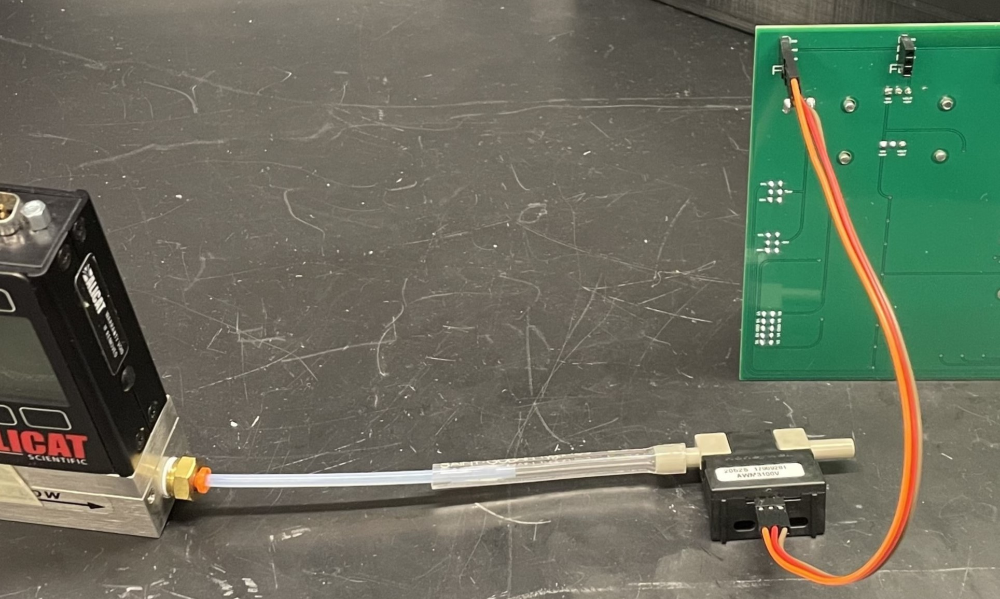
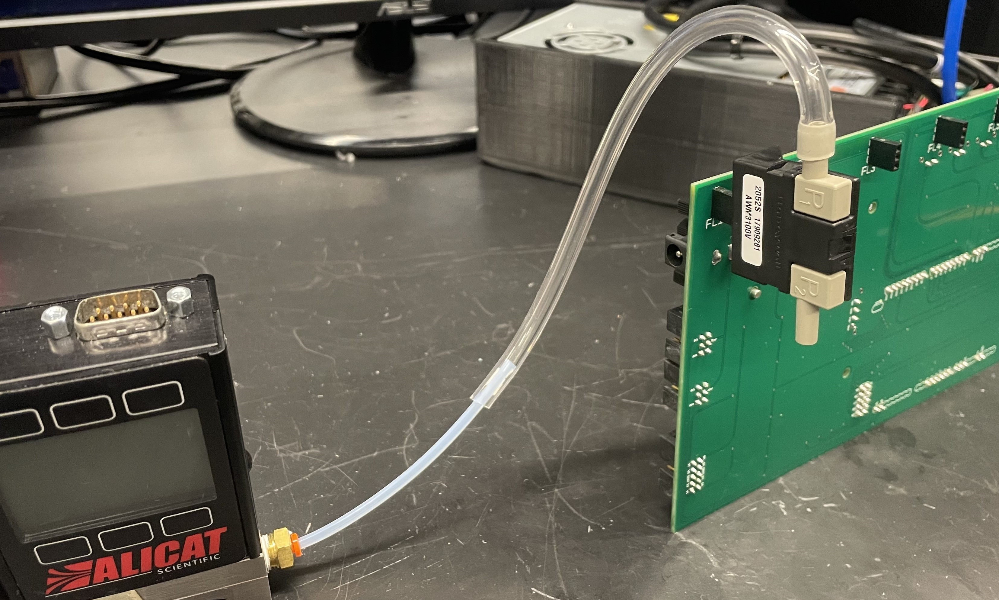
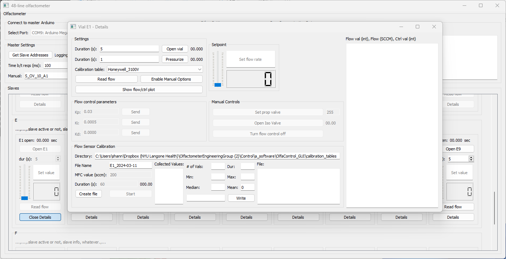
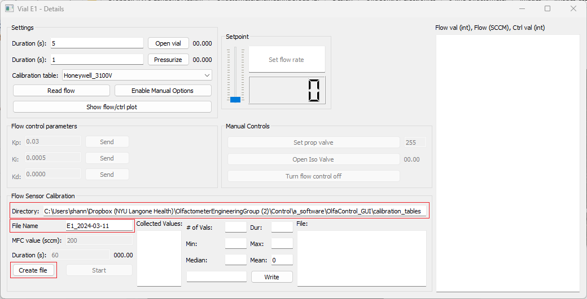
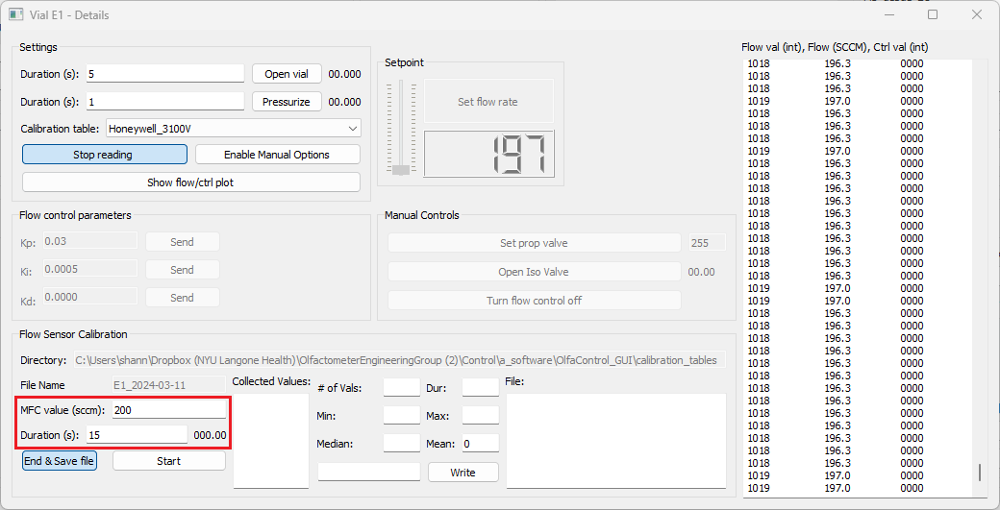
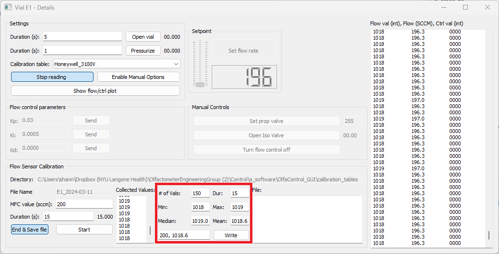
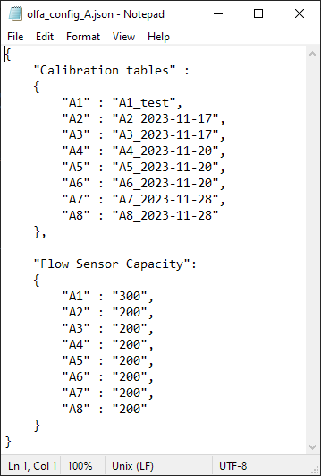

# Flow Sensor Calibration

To ensure accurate flow readings, each flow sensor should be individually calibrated before use.  

The calibration table for each flow sensor csv file contains flow rates (in SCCM) and the corresponding flow sensor value (as an integer from 0-1023).  

 

*
      *Example calibration table:*  
*

    

 
 

## Hardware setup

***Note**:* With the current system, the most efficient way to calibrate new flow sensors is prior to installation onto the main manifold. Calibrating while sensors are installed on the manifold can be more time consuming due to pressure changes when changing setpoints, so use your own discretion depending on how many flow sensors need to be calibrated (decide whether it would be more time consuming to take them all off or not)

 

**Setup options:**  

### **A. On Manifold** (Flow sensor still installed on olfactometer manifold)  
&nbsp;&nbsp;&nbsp;&nbsp;***Recommended when calibrating 1 or 2 flow sensors***  
&nbsp;&nbsp;&nbsp;&nbsp;Example use: Recalibrating/checking calibration of currently installed flow sensors  
 

The system must be slightly altered for calibration to ensure that the known quantity of air from the Alicat MFC is passing entirely through the flow sensor being calibrated:  
 

    

1. Disconnect the tubing between the Alicat MFC and the mixing chamber, and plug the open fitting. This ensures that the known quantity of air delivered (from the MFC) is all passing through the flow sensor.

2. Disconnect the flow sensor output from the vial. This allows the air to easily pass through the flow sensor. (Easiest way to do this is to twist the needle to disconnect it from the luer fitting on the flow sensor tubing.)

3. Fully open the proportional valve via the olfactometer GUI.
	- Open the Vial Details popup window.
	- Select "Enable Manual Options"
	- In the "Manual Controls" box, enter "255" next to the "Set prop valve" button.
	- Click "Set prop valve".

    

 

### **B. Off Manifold**  
&nbsp;&nbsp;&nbsp;&nbsp;***Recommended when calibrating 4+ flow sensors***  
&nbsp;&nbsp;&nbsp;&nbsp;Example use: New sensors that have not been installed yet

 

1. Connect the MFC input to an air supply.  
2. Connect the MFC output directly to the flow sensor input. (Flow sensor works well with 1/8" ID flexible tubing, which can be slid over 1/8" OD Teflon tubing to make a sufficiently airtight seal for this application).  

    

 

3. Connect the flow sensor to the Olfactometer PCB (either directly, or using jumper wires, whichever is more convenient).  

    
    

4. Connect the Olfactometer PCB to the computer and 24V power supply as usual.  
 

## Software

### Create File

1. Open the Olfactometer GUI and connect to the device.  
2. Open the Vial Details box for the selected flow sensor.  

    

3. Confirm/edit the calibration table directory and enter the desired file name.  
4. Click "Create File". (This will create the file and set the flow sensor to "debug" mode, if it is not already.)  

    

 
 

## Calibrate

***Note:** Calibration tables **must** be in descending order, so it is recommended to start calibrating at the maximum capacity and work down from there. Otherwise, the table will need to be manually sorted after completing the calibration.*  

1. Physically set the Alicat MFC to the first desired calibration value. (Ideally, the maximum capacity of the flow sensor - 200 sccm.) Enter that same value into the "MFC value (sccm)" box.  
&nbsp;&nbsp;&nbsp;**Note:** If calibrating while flow sensor is installed on the manifold, the Alicat MFC may not be able to reach 200 sccm (due to high impedance within the olfactometer manifold). If this is the case, start calibration at the highest flow rate the Alicat MFC is able to maintain (at least 120 sccm for experiments that will go up to 100 sccm).    

2. Enter the desired duration of the calibration. (15 seconds is typically sufficient for off-manifold calibration, 30 seconds may be necessary for on-manifold calibration.)  

   

    

3. Click "Start".  

4. Once calibration at this flow rate is complete, stats about the flow sensor data collected during that period will populate the fields in the center of the groupbox. By default, the values to write to the calibration files will display in the bottom-right box (flow rate [sccm], mean value [int]).  

    

&nbsp;&nbsp;&nbsp;&nbsp;&nbsp;&nbsp;&nbsp;&nbsp;&nbsp;&nbsp;&nbsp;&nbsp;&nbsp;&nbsp;Don't worry about the SCCM flow rate being displayed - this is calculated based on the currently selected calibration table.  

&nbsp;&nbsp;&nbsp;&nbsp;&nbsp;&nbsp;&nbsp;&nbsp;&nbsp;&nbsp;&nbsp;&nbsp;&nbsp;&nbsp;Check if the calibration was successful by looking at the range of the values collected from the flow sensor during the calibration. If the range is more than 4, repeated trials are recommended.  
&nbsp;&nbsp;&nbsp;&nbsp;&nbsp;&nbsp;&nbsp;&nbsp;&nbsp;&nbsp;&nbsp;&nbsp;&nbsp;&nbsp;&nbsp; - For on manifold calibration, when the Alicat MFC value is changed, the pressure within the system can take 1-2 minutes to stabilize, which affects the flow sensor readout.  
&nbsp;&nbsp;&nbsp;&nbsp;&nbsp;&nbsp;&nbsp;&nbsp;&nbsp;&nbsp;&nbsp;&nbsp;&nbsp;&nbsp;&nbsp;- (Typically, at a single flow value, I run two 15-second calibrations and save the mean of the second one. If the means of the two calibrations differ by more than 1 on-manifold, more than 0.5 off-manifold, I would recommend running additional 15-second calibrations until stability is reached.)  

5. If the calibration seemed fine, click the "Write" button to write this pair to the calibration file. You can also manually enter the value to write to the file, if you'd like to use the median value instead. (Values already written to the file will be displayed in the far right box.)  

6. **Repeat for as many values as desired.** (I typically do 10sccm increments, to save time. For more sensitive experiments, 2-5 increments may be more helpful.)

 

## Once complete:

1. Click "End & Save File"
2. Go to the calibration table directory, and change the file extension from .csv to .txt. (Ignore any warnings about the file becoming unusable.)
3. Update the olfa_config file (using any text editor) to include the name of the new calibration table.

*
      *Example olfa_config file:*  
*

    

