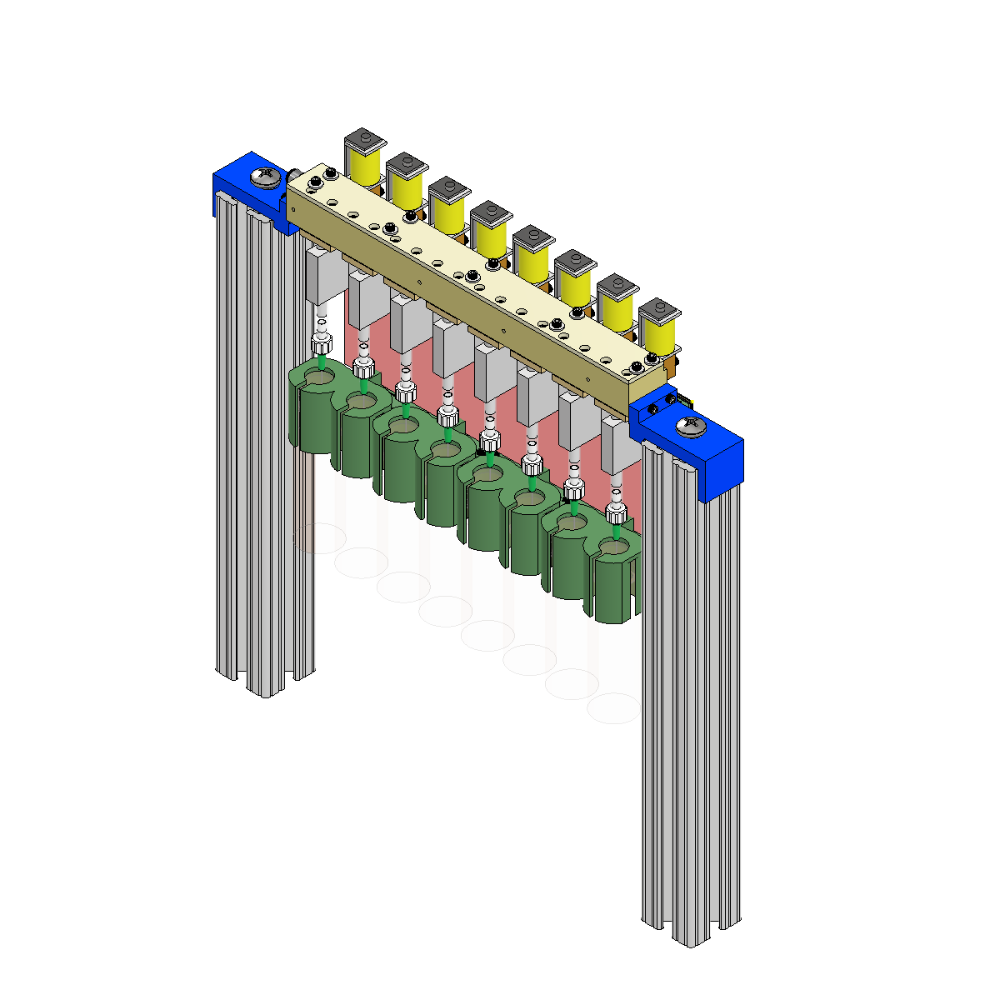
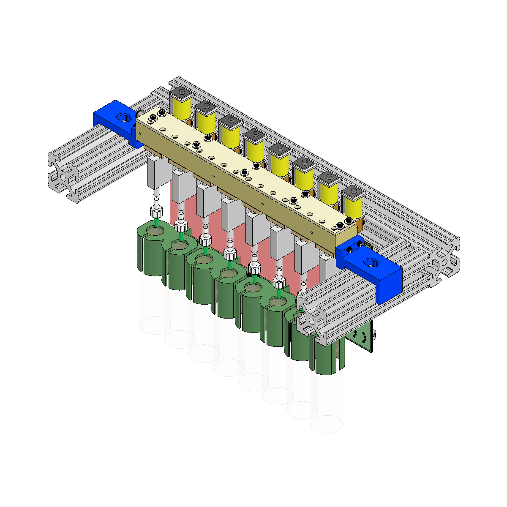
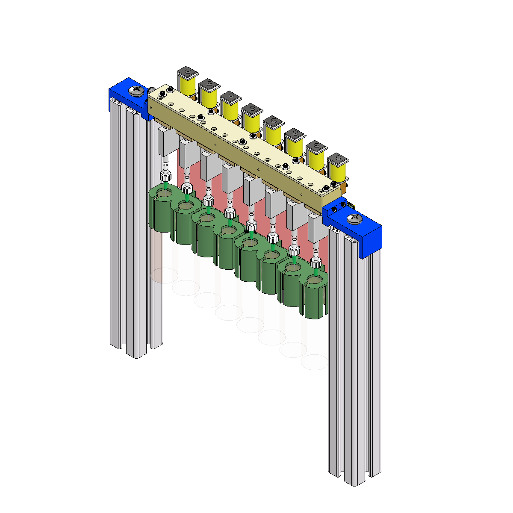
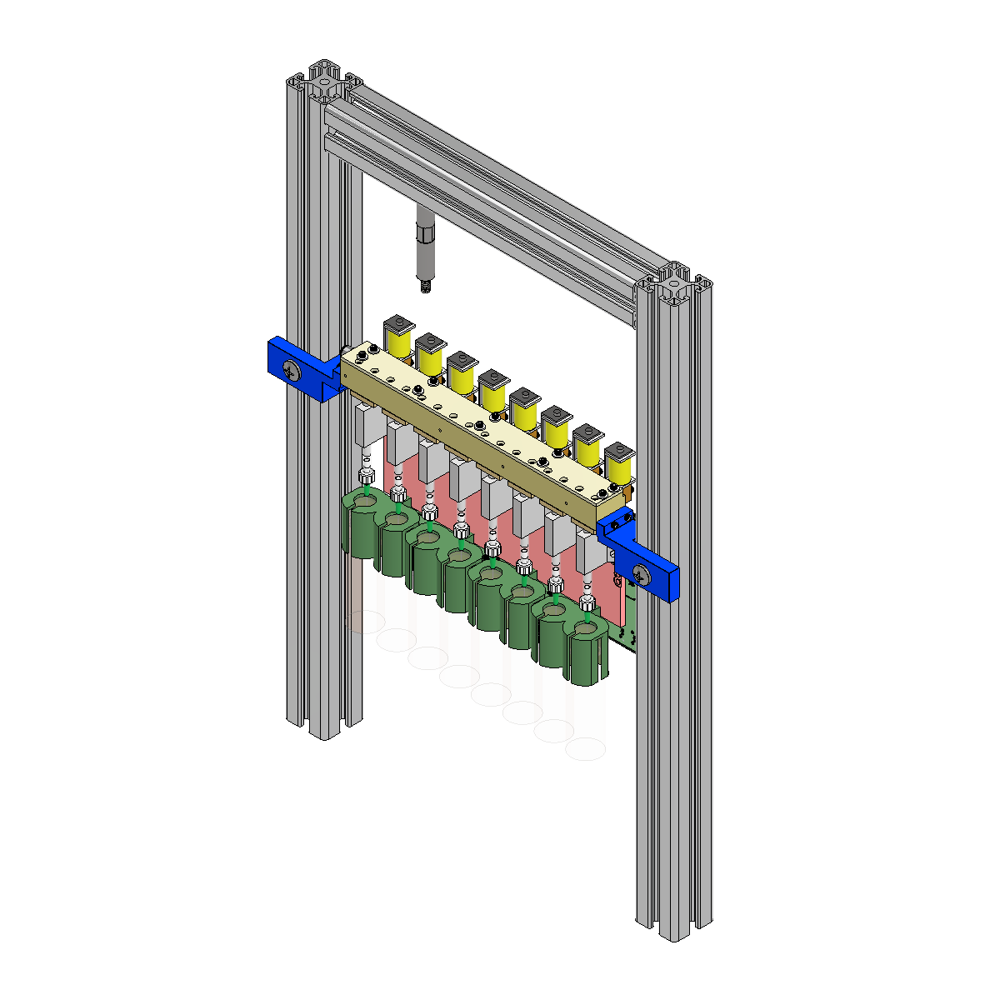

### for mounting with sliding or standing setup
Hole (for mounting with standing setup) will fit M8 or 5/16" screw

 

<!--BigAssembly_01_8020_1515.iam-->
**mount_bracket 8020_1515_withhole**  
Fits on 1.5" profiles from 8020

  
  

 

<!--BigAssembly_01_item_8.iam-->
**mount_bracket item_8_withhole**  
Fits on 40mm profiles from item

  

<!--
## TODO:
- add sliding setup for item
- add links to item and 8020 profiles
-->

#
### Current setup in Mainland lab:
<!--BigAssembly_02.iam-->
**mount_left**  
**mount_right**  
Mounted using 40mm profiles from item, M8 screws

  

<!-- 
For mounting with sliding setup only:

**mount_bracket 8020_1515**
Fits on 1.5" profiles from 8020

**mount_bracket item_5**
Fits on 20mm profiles from item
-->