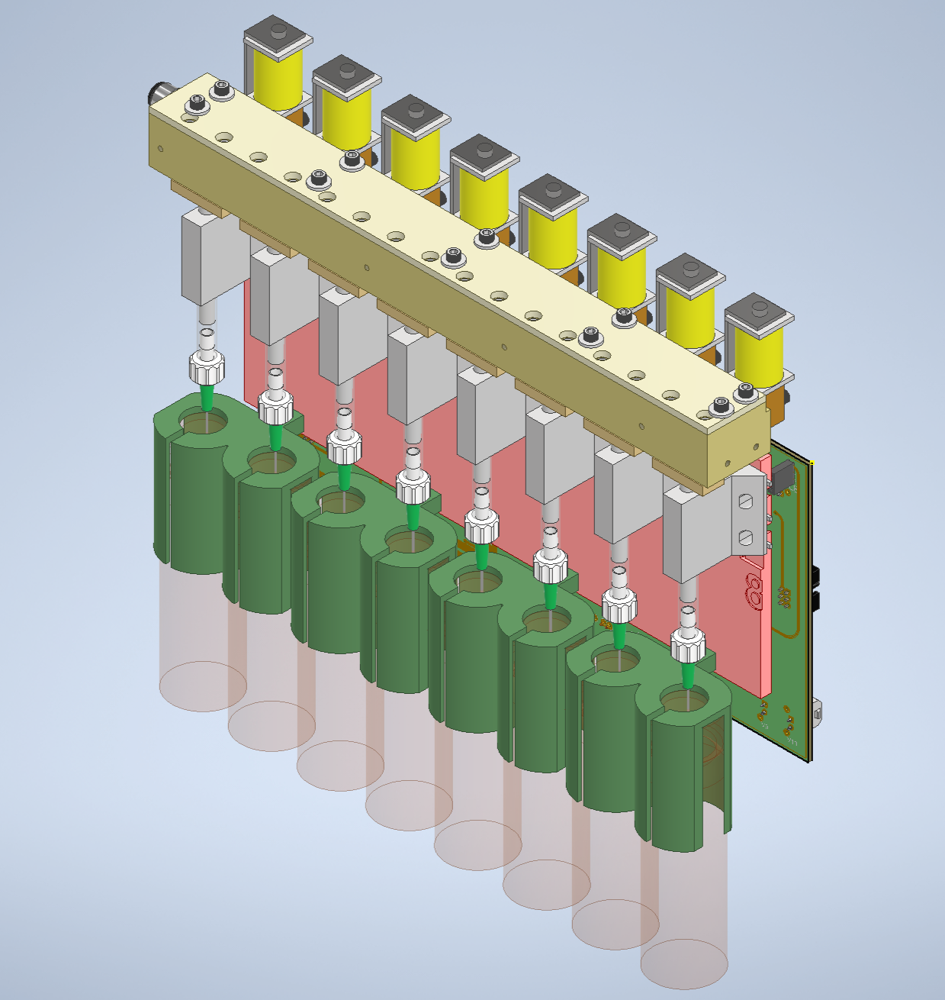

# 8-line Olfactometer Hardware

  

# Parts to be manufactured

to make a single 8-line unit:

- (x1) top_cover
- (x1) main_manifold_8v
- (x8) main_manifold_cover

##
## updates for version 2:

- **main manifold:**
  - mounting holes for main plate on both sides
- **main manifold cover:**
  - 0.01" decrease in length (screw holes are now symmetric)
