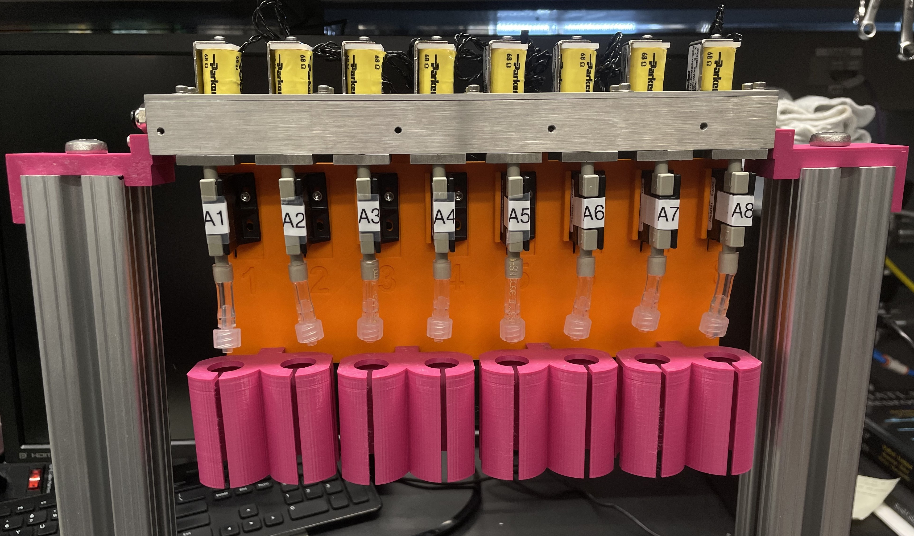
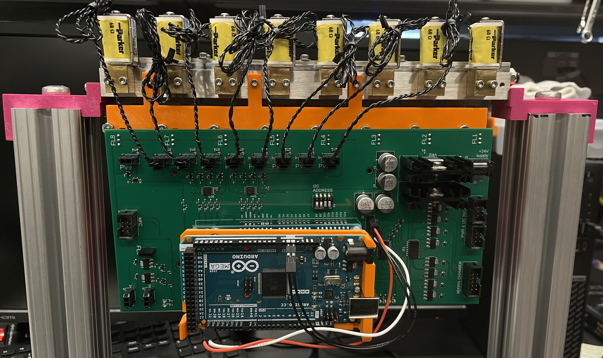

# 8-line Olfactometer

 

  
  

  

  

 

# Parts to be manufactured

to make a single 8-line unit:

- (x1) top_cover
- (x1) main_manifold_8v
- (x8) main_manifold_cover

  

## updates for version 2:

- **main manifold:**
  - mounting holes for main plate on both sides
- **main manifold cover:**
  - 0.01" decrease in length (screw holes are now symmetric)

  
 

# Troubleshooting

**Problem:** Inconsistent, "squiggly" odor signal

**Diagnosis:**  Likely something (probably part of the septum) caught in the needle, blocking air flow into the vial

**Solution:** Replace vial input needle

##
**Problem:** Slow odor rise time

**Diagnosis:** Leak

**Solution:**  
- Ensure vial cap is on tightly
- Check that isolation valve is completely screwed in
- Replace tubing from vial to mixing chamber

##
**Problem:** Olfactometer not sending back flow values once turned on

**Solution:**  
If it is sending back slave addresses:
- Wait 30 seconds or so
- Click "Get Slave Addresses" 1 or 2 times
- If still a problem: Turn 24V power off and back on again, and repeat above steps

If it's not sending back slave addresses:
- Check that PCB is receiving 24V power
- Check that master Arduino I2C pins are correctly connected
- Reupload master Arduino code

##
**Problem:** Zero flow reported, even when proportional valve signal is at max (255)

**Solution:** Replace proportional valve

